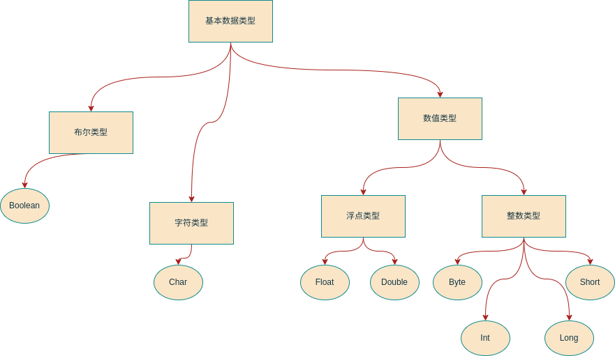

# 数据类型

Kotlin的基本数据类型与Java、C++基本对应。事实上绝大多数程序语言的基本数据类型都差不多。



在Java中8中基本数据类型不属于类，也就不具备“对象”特征，无法进行面向对象操作。Java的解决方案是提供包装类将基本数据类型进行封装，使之每个包装类对象封装一个基本数据类型数值。而在Kotlin中基本数据类型没有对应的包装类，Kotlin编译器根据不同场景将其编译成Java中的基本类型数据或者包装类对象。

## Kotlin基本数据类型

### 整数类型

与Java相同，Kotlin中数据类型不依赖于具体计算机，依靠虚拟机实现跨平台的同时所有数据类型大小均是固定的。1字节：8位

| 整数类型  | 宽度  |               取值范围               |
|:-----:|:---:|:--------------------------------:|
| Byte  | 1字节 |             -128~127             |
| Short | 2字节 | -2<sup>15</sup>~2<sup>15</sup>-1 |
|  Int  | 4字节 | -2<sup>31</sup>~2<sup>31</sup>-1 |
| Long  | 8字节 | -2<sup>63</sup>~2<sup>63</sup>-1 |

Kotlin默认整数类型为Int，Long类型需要在数值后加L（不允许加“l”，容易造成误解）

对整数变量赋值时，可以使用二进制（0b/0B）和十六进制（0x/0X）表示，但不支持八进制。

### 浮点类型

|  浮点类型  | 宽度  |
|:------:|:----|
| Float  | 4字节 |
| Double | 8字节 |

Kotlin默认浮点类型为Double，如需表示Float类型需要在数值后加上F或f。

同时，在进行数学算术运算时可能会使用到指数运算，Kotlin通过e<sup>num</sup>的方式用于表示指数值。例如：`2e2`表示2*10<sup>2</sup>。

### 字符类型

与Java将字符类型归类于数值类型不同，Kotlin中字符类型独立存在，用于表示单个字符并用单引号括起来。

同时与Java一致的是，Kotlin字符采用双字节的Unicode编码，可以用十六进制（无符号）编码形式表示：

```kotlin
val v1 = '\u0041' // v1 is 'A'
```

对一些特殊字符，需要字符转义：

| 字符表示 | Unicode编码 | 说明  |
|:----:|:---------:|:---:|
|  \t  |  \u0009   | tab |
|  \n  |  \u000a   | 换行  |
|  \r  |  \u000d   | 回车  |
|  \"  |  \u0022   | 双引号 |
|  \'  |  \u0027   | 单引号 |
|  \\  |  \u005c   | 反斜号 |
|  \$  |  \u0024   | 美元符 |
|  \b  |  \u0008   | 退格  |

### 布尔类型

与Java一致，布尔类型并不属于数值类型，所以无法用1或0表示true和false，也无法与数值类型进行转换。

```kotlin
// val v1:Boolean=1 // false
```

## 数值类型转换

数值类型之间的转换在赋值阶段采用显示转换，在数学计算上采用隐式转换。

### 显式转换

与C和C++不同，Kotlin的类型检查非常严格，无法直接对不同类型之间进行赋值：

```kotlin
val v1: Byte = 1
// val v2:Int=v1 // false
```

想要实现赋值转换，则必须通过转换函数显示转换：

- toByte()
- toShort()
- toInt()
- toLong()
- toFloat()
- toDouble()
- toChar()

> 需要注意到：从大范围（宽度）转换到小范围（宽度），会造成精度损失。因为程序会直接将大范围数值的高位截取，那么如果高位存在数值，则转换得到的数值便是错误数值；如果大范围数值本身值较小，则可能数值本身没有问题。
>
> 对于字符类型转换为数值类型，建议使用字符类型对象的`code`成员函数，不建议直接使用`toInt`函数（已废弃）

### 隐式转换

当存在多个不同类型的数值进行算术运算，由于其参与的数值类型不一致，原则其结果类型与参与运算数值的最大类型保持一致。

|           操作数1            |  操作数2  | 转换后类型  |
|:-------------------------:|:------:|:------:|
|           Byte            |  Byte  |  Int   |
|           Byte            | Short  |  Int   |
|        Byte,Short         |  Int   |  Int   |
|      Byte,Short,Int       |  Long  |  Long  |
|    Byte,Short,Int,Long    | Float  | Float  |
| Byte,Short,Int,Long,Float | Double | Double |

## 可空类型

Kotlin与Swift语言类似，默认情况下所有的数据类型均是非空的，声明的变量不能接收空值。

如果需要接收空值，则需要用到每种非空类型提供对应的可空类型（在非空类型后加上?表示）

对于可空类型在具体实现上存在一些限制：

- 不能直接调用可空类型对象的函数或属性
- 不能把可空类型数据赋值给非空类型变量
- 不能把可空类型数据传递给非空类型参数的函数

为了“突破”这些限制，Kotlin提出以下运算符：

- 安全调用运算符（?.）
- 安全转换运算符（as?）
- Elvis运算符（?:）
- 非空断言（!!）

> 安全调用运算符：
>
> 可空类型可以通过安全调用运算符调用其函数或属性，通过该运算符判断空类型变量是否为空，如果是**返回空值**，如果不是调用函数或属性。
>
> 非空断言运算符：
>
> 非空断言运算符作用就是断言可空类型不会为空，如果可空类型为空，**抛出空指针异常**，否则正常调用函数或属性。
>
> Elvis运算符：
>
> 当希望表达式为空值，但是不希望返回默认的空值。Elvis运算符（空值合并运算符）让其可以自定义表达式为空时返回值内容，其理论结构类似三目运算符。


